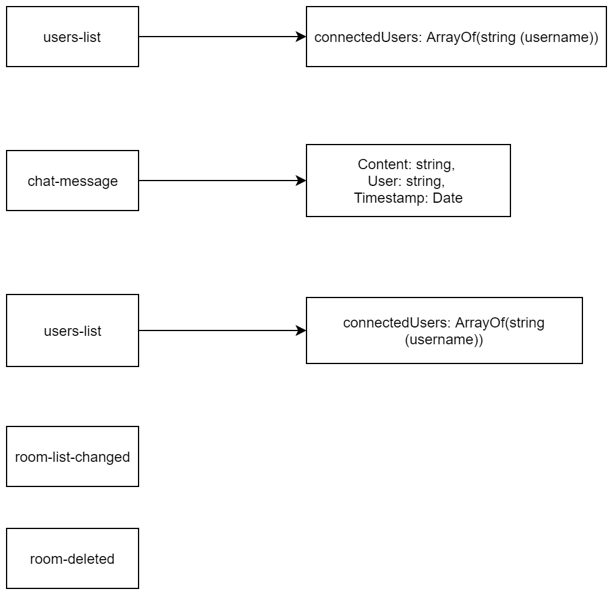

# socket-io-chat-server
======================

Chat server written in Node.js using socket.io, which is an open-source Javascript real-time 
messaging framework. This very implementation is configured for use on Azure Web Services. You can find
the server at the link below.

See also: [socketiochatserver](https://socketiochatserver.azurewebsites.net/)

Windows client for this particular server can be found on the link below.

See also: [Socket IO Chat Client](https://github.com/baso53/SocketIOChatClient)

# Features
* Chat rooms (protected and unprotected)
* Creating chat rooms
* Deleting a chat room with master password set on creation of the room
* Real-time updating of connected users in the lobby and in rooms
* Usernames

# Implementation
This server is using bcrypt.js package for storing passwords in the database, so they are 
stored securely on the server. Database used is MySQL In App on Azure, which provides 20MB of free 
storage.

Most of the messaging between the server and the client is initiated on the client side, as 
I wanted to avoid pushing data to client, who might not always be ready to receieve the data.

Server API representation can be found below.

Squares on the left are the request strings that server sends, right 
are all the potential responses from the client in JSON (I didn't include the outer brackets of JSON), 
only one of which gets sent as the response.

# Special thanks
* BB
* Creator of C# Socket.io client
* socket.io for providing such an awesome framework